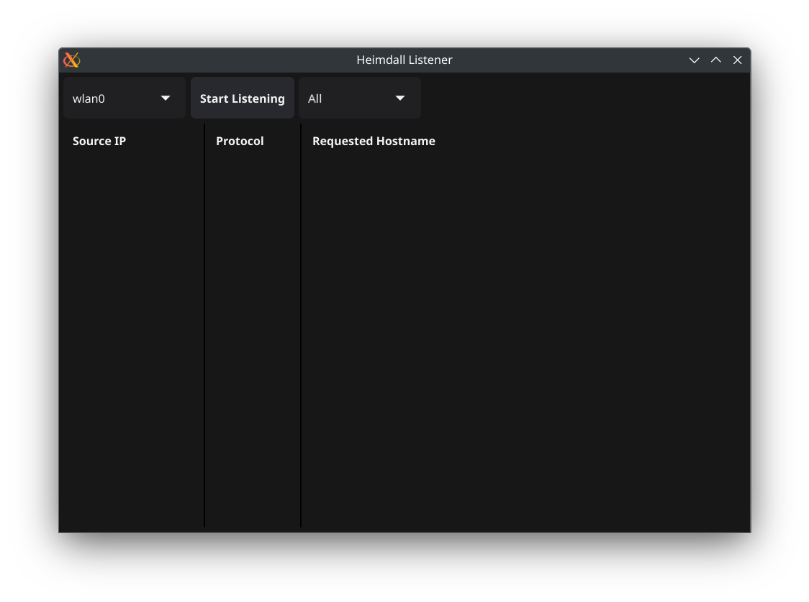
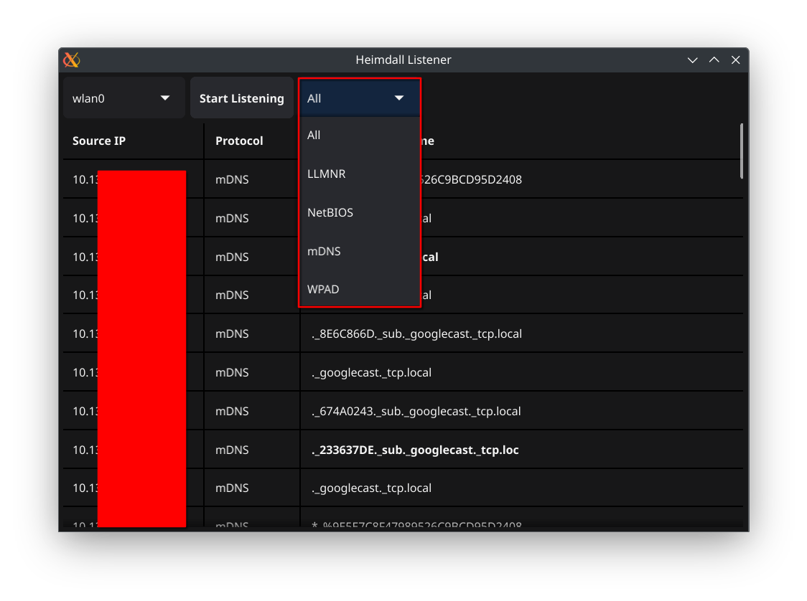

# Disclaimer
This software is provided "as is" without any warranty of any kind. I make no guarantees that it will correctly identify all protocol traffic, or that it will function in your specific setup. Use at your own risk. I assume no responsibility for any damage, loss, or issues that may arise from the use, installation, or modification of this tool. By using this software, you agree that you understand these terms.

# Heimdall Listener
Heimdall Listener is a project that I wanted to create to help system administrators better defend their networks by identifying the use of legacy broadcast traffic (LLMNR, NetBIOS, mDNS) that could allow an attacker to gain a better foothold inside the environment or escalate privileges. Another aspect is the weaknesses of WPAD. Very popular tools on the attacker side are such as Responder, MITM6, NTLMRealayx. These tools rely mainly on the use of these legacy protocols to relay the hashes to other protocols or store to crack offline. This tool is aimed to help identify the hosts making the broadcast request so that you can disable the protocols and better protect your organization.


# Installation
The best method of installation is by using Go native installation but this requires that Go has been installed on your host and the Path setup using their instructions https://go.dev/doc/install.

You can install on Windows, Mac or Linux by using the following command:
```shell
go install github.com/ZerkerEOD/heimdall-listener@latest
```

If you prefer to download and run, then I have provided executable binaries for Windows and Linux. 

# Operating
I tried to design Heimdall Listener to be easy for all system administrators or even home users that are interested into a quick and easy method to identify the protocols. It was created using the Fyne GUI framework so that the user doesn't need to remember or run terminal commands with various switches.

The program must run with elevated privileges. This means running as Administrator on Windows and sudo on Linux based OS's. This is due to the requirement to operate at the network level to listen in on traffic from interfaces. 

Once you open the program, you will be greeted by a box that reminds you that it must be run with elevated privileges. This can be ignored if you already did, if not please restart the program properly.

Next you will see a drop down in the upper left that allows you to select which interface to listen in on. 


Once you have selected the proper interface you can select the 'Start Listening' button and let it sit. As broadcast traffic will only be identified as it is broadcast out I recommend letting it run for a while to see what appears.

I built in a filter feature to only show certain protocols if you are wanting to look for any specific items while remediating. You can use the drop down to the right to select what protocols to show (the program is still listening for all just filtering the view for the specific one). The filter bar can be used while actively listening and after a listen.


In order to refresh the output you will need to close the application and restart it. I have not built in a renew/refresh option and can do so if enough people think they would use it.

After that you should have the source of your issue and the protocol that is being used and the requested resource. The focus is the source IP, the requested resource is useful to identify why it may be making a request.

# Important Note:
If you have any type of mDNS traversal options to help with IoT devices for betting connections between VLAN's, the IP address of the source is going to be your Gateway or Firewall. This is by design as the Gateway/Firewall will repeat the action and carry on the broadcast on additional segments. There is not a way that I can see identifying the actual source when it goes across VLAN's. Due to this you will need to connect to each VLAN and let it run until you identify the actual device.

# Bug and Feature Requests
As this is a side project of mine and will work on bugs or feature requests as I have time.

# Donations
As this project is a side project, it was created for fun to help organizations. If this helped you were able to disable to better secure your organization and look like a hero by helping prevent maybe a Pentest or Red Team from gaining access, then I wouldn't say no to a coffee or donation.

```markdown
[
  ![Donate with PayPal]
  (https://raw.githubusercontent.com/stefan-niedermann/paypal-donate-button/master/paypal-donate-button.png)
]
(https://paypal.me/ZerkerEOD/)
```
